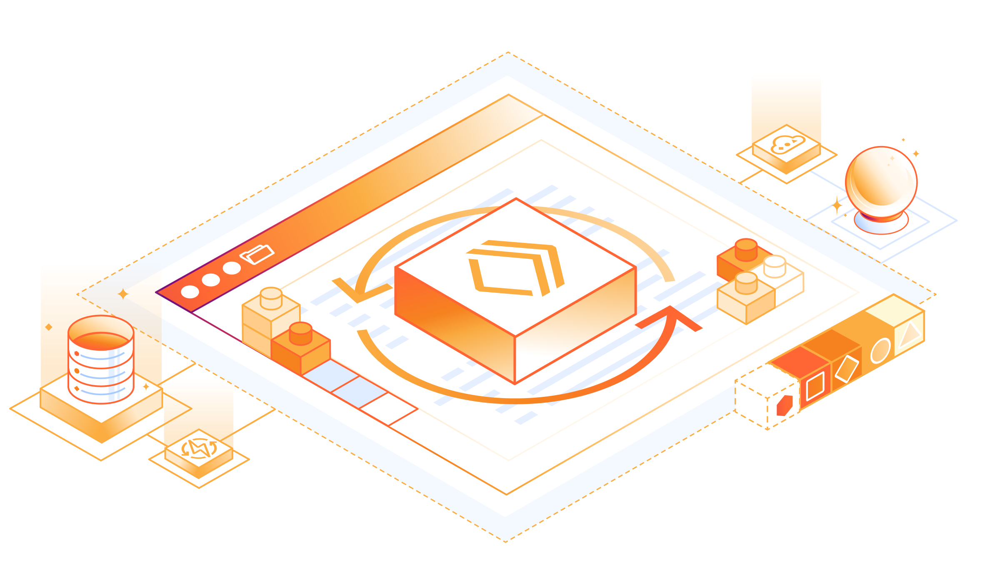
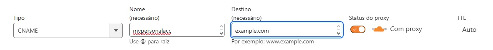

<div align="center">

</div>

<h1 align="center">Cloudflare Worker Bluesky Handler</h1>
<p align=center><i align="center">Router based on Hono for Cloudflare Worker implementation in order to change Bluesky's route for DID validations</i></p>
<div align="center">

<a href="https://hono.dev/docs"></a>&nbsp;
<a href="https://www.typescriptlang.org"></a>&nbsp;
<a href="https://developers.cloudflare.com/workers"></a>&nbsp;
<br>
<a href=""></a>&nbsp;
<a href=""></a>&nbsp;
<a href=""></a>&nbsp;
<br>
<a href=""></a>&nbsp;
<a href=""></a>&nbsp;
<a href="https://github.com/dexdevlab/cloudflare-worker-bluesky-handler/blob/main/LICENSE"></a>&nbsp;

</div>

<br>

This repository purpose is to contain all the implementation needed to having multiple custom Bluesky Handles using DNS registration, Workers and Routes from Cloudflare.

## Motivations

Since Bluesky don't accept the creation of the [same domain handle for multiple accounts](https://github.com/bluesky-social/social-app/issues/1085) and I have friends who wanted this I studied and applied an implementation in easy steps.

## Additional Notes

- [Changelog](https://github.com/DexDevLab/cloudflare-worker-bluesky-handler/blob/main/CHANGELOG.md)

## Instructions

> [!IMPORTANT]
> This documentation is intended for developers or network/web connoisseurs and it is presumed you already met the requirements listed below.

### Requirements

1 - Purchased a [custom domain](https://www.google.com/search?q=how+to+purchase+a+custom+domain)

2 - Registered for a [Cloudflare account](https://www.cloudflare.com/pt-br/lp/pg-one-platform-ppc)

3 - Added your domain for [management via Cloudflare](https://developers.cloudflare.com/registrar/account-options/domain-management)

4 - Registered all your intented handles via [CNAME registration](https://community.cloudflare.com/t/how-to-set-up-dns-records-for-cloudflare/586151) like the example below:



> [!TIP]
> Where `mypersonalacc` is the handle and `example.com` is the domain.

If you met those requirements then you are ready to go.

### Clone the repository

1 - Git clone or download the repository, as you want

```bash
git clone https://github.com/dexdevlab/cloudflare-worker-bluesky-handler.git
```

2 - Explore the repo using your preferred IDE, open terminal and install dependencies using `yarn` or `npm`

### Customize

1 - Rename [wrangler.toml.example](https://github.com/DexDevLab/cloudflare-worker-bluesky-handler/blob/main/wrangler.toml.example) to `wrangler.toml` and customize its contents:

```toml
# Change the worker name as you like
name = "worker-name"
...

# Change the domain according your own domain. Keep the wildcards in the pattern
routes = [{pattern = "*.domain.com/*", zone_name = "domain.com"}]
```

2 - Rename [dids.ts.example](https://github.com/DexDevLab/cloudflare-worker-bluesky-handler/blob/main/src/utils/dids.ts.example) to `dids.ts` and customize its contents:

```json
...
return {
      // Default domain address for handler
      domain: "company.com",
      // Redirect request site for any unindentified route (e.g. *)
      default: "https://site.company.com",
      // Where 'handle' is the main string before the domain at your handle. (e.g. alexa.company.com => handle = 'alexa')
      // Where 'did' is the did obtained
      ['handle']: "[did]",
  };
```

### Testing Local Execution

1 - After customizing as above, run the application via terminal using `yarn dev`. The web server will run at `http://localhost:8787`

2 - Test performing a GET method via HTTP or directly to the browser using the test endpoint `http://localhost:8787/test/:handle` where `:handle` is a handle defined in `dids.ts`. If succeeded, the request will return status `OK 200` with the DID string in the format `did:plc:acbdef`

### Deployment via Cloudflare Worker

1 - Via terminal, run the command `yarn deploy`. Wrangler will connect to Cloudflare, authenticate and create a worker.

In this step, it is not necessary change any information previously provided. Just proceed to deploy application.

If succeeded, on Cloudflare Workers Dashbord or via Worker Routes you will find a worker called by "workername-production", where "workername" is the name given via field `name = "worker-name"` in `wrangler.toml`.

> [!TIP]
> You can check for additional information in the [workers documentation](https://developers.cloudflare.com/workers).

### Cloudflare Configuration

1 - Over the DNS Records page in your domain, at the left, you will find the option "Worker Routes". Click to access the Worker Routes page.

2 - In this page, click on "Add Route" to create a new Route for the worker. On "route", select the same route (including wildcards) defined in `wrangler.toml` in the field `pattern = *.domain.com/*`.

The new set route will be shown on the page.

### Test Cloudflare Worker Route

1 - Now, for testing Cloudflare Work Route, just access the address `handle.company.com/test/:handle`, as you added the DNS Record in step 4 in [Requirements](#requirements) section, and changing the slug `:handle` as in [Testing](#testing-local-execution).

If you reach the address and got the DID in your browser screen or HTTP tool, it's a success!

### Customizing the handle via Bluesky

Now you can use your custom handle via Bluesky using the section "No DNS Panel", according the [docs](https://bsky.social/about/blog/4-28-2023-domain-handle-tutorial). You can also debug the DID token sent and the worker route via [Bluesky Debug](https://bsky-debug.app/handle).

## Authors

<a href="https://github.com/dexdevlab/cloudflare-worker-bluesky-handler/graphs/contributors">
  
</a>

## Contact

If you like this project, give a <a href="https://github.com/dexdevlab/cloudflare-worker-bluesky-handler" data-icon="octicon-star" aria-label="Star dexdevlab/cloudflare-worker-bluesky-handler on GitHub">⭐​</a>. <br>
For contacting me, send an email to: <a href="mailto:dex.houshi@hotmail.com">dex.houshi@hotmail.com</a>

## License

Licensed under [MIT License](https://github.com/dexdevlab/cloudflare-worker-bluesky-handler/blob/main/LICENSE).
