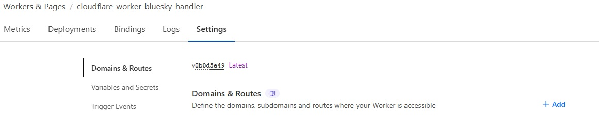

<div align="center">

</div>

<h1 align="center">Cloudflare Worker Bluesky Handler</h1>
<p align=center><i align="center">Router based on Hono for Cloudflare Worker implementation in order to change Bluesky's route for DID validations</i></p>
<div align="center">

<a href="https://hono.dev/docs"></a>&nbsp;
<a href="https://www.typescriptlang.org"></a>&nbsp;
<a href="https://developers.cloudflare.com/workers"></a>&nbsp;
<br>
<a href=""></a>&nbsp;
<a href=""></a>&nbsp;
<a href=""></a>&nbsp;
<br>
<a href=""></a>&nbsp;
<a href=""></a>&nbsp;
<a href="https://github.com/dexdevlab/cloudflare-worker-bluesky-handler/blob/main/LICENSE"></a>&nbsp;

</div>

<br>

This repository purpose is to contain all the implementation needed to having multiple custom Bluesky Handles using DNS registration, Workers and Routes from Cloudflare.

## Motivations

Since Bluesky don't accept the creation of the [same domain handle for multiple accounts](https://github.com/bluesky-social/social-app/issues/1085) and I have friends who wanted this I studied and applied an implementation in easy steps.

## How it Works

When the user set a new handle with a custom domain under NO DNS section in Bluesky Profile Account Handle Configuration, Bluesky requests a DID code from a domain using the pattern `https://handler.company.com/.well-known/atproto-did`, which must explicitly return a `OK 200` response under the header `text/plain`, with the DID code for the handle: `did:plc:abcdef`.

This application, running as a Cloudflare Worker, intercept the Bluesky request using Cloudflare Proxy (a.k.a. "Orange Cloud") and the Worker Route.

Then, the Worker:

1 - Parse the request url

2 - Get the handle

3 - Access the `dids.json` file, locally or in the web which contains all the handles and the DIDs (check [Customize](#customize) section for details) to be checked for the domain

4 - Matches the requested handle and one of the listed handles from the `dids.json` file

5 - Return the result, or a message if no handle were found

## Additional Notes

- [Changelog](https://github.com/DexDevLab/cloudflare-worker-bluesky-handler/blob/main/CHANGELOG.md)

## Instructions

> [!IMPORTANT]
> This documentation is intended for developers or network/web connoisseurs and it is presumed you already met the requirements listed below.

### Requirements

1 - Purchased a [custom domain](https://www.google.com/search?q=how+to+purchase+a+custom+domain)

2 - Registered for a [Cloudflare account](https://www.cloudflare.com/pt-br/lp/pg-one-platform-ppc)

3 - Added your domain for [management via Cloudflare](https://developers.cloudflare.com/registrar/account-options/domain-management)

4 - Registered all your intented handles via [CNAME registration](https://community.cloudflare.com/t/how-to-set-up-dns-records-for-cloudflare/586151) like the example below:

<div align="center">

</div>

> [!TIP]
> Where `mypersonalacc` is the handle and `example.com` is the domain.

If you met those requirements then you are ready to go.

### Clone the repository

1 - Git clone or download the repository, as you want

```bash
git clone https://github.com/dexdevlab/cloudflare-worker-bluesky-handler.git
```

2 - Explore the repo using your preferred IDE, open terminal and install dependencies using `yarn` or `npm`

### Customize

1 - Customize the file [wrangler.toml](https://github.com/DexDevLab/cloudflare-worker-bluesky-handler/blob/main/wrangler.toml):

```toml
# Change the worker name as you like
name = "worker-name"

# Change the URL according to your dids.json file location, as a string. If you want to use an external dids.json list,
# change this value to the file download url
DID_LIST_URL = false

# Change the domain according your own domain. Keep the wildcards in the pattern
routes = [{pattern = "*.domain.com/*", zone_name = "domain.com"}]
```

2 - Set `dids.json` file properly

Customize the file [dids.json](https://github.com/DexDevLab/cloudflare-worker-bluesky-handler/blob/main/src/dids.json):

```javascript
{
  "config": {
    // Default domain address for handler
    "domain": "company.com",
    // Redirect request site for any unindentified route (e.g. *)
    "defaults": "https://site.company.com"
  },
  "handles": {
    // In this example, 'alexa' is the handle, for the domain set in
    // 'config.domain', shown in Bluesky as @alexa.company.com
    // Remember to add its own DID value according to your handles
    "alexa": "did:plc:r5focyhdgmgmgfkfbdxs5y24xeinl"
  }
}
```

You can get your DID easily browsing the [Bluesky Handle Resolver API](https://bsky.social/xrpc/com.atproto.identity.resolveHandle) under the address `https://bsky.social/xrpc/com.atproto.identity.resolveHandle?handle=yourcurrenthandle.bsky.social`. Change `handle` to your currently enabled handle in Bluesky.

If you let `DID_LIST_URL` in its default value (`false`), you are ready to the next step. However, if you want to use an external json file containing your DIDs so you can change the file without the need of redeploy the application, follow the steps below:

1 - Upload `dids.json` file to your preferred file host (e.g. Google Drive, Dropbox, Microsoft OneDrive or even a custom file server)

2 - Generate the **direct download link** or get the **download url** for your file

> [!TIP]
> Keep in mind the difference between **sharing link** and the **download link**. Some File Host Providers (like Google Drive) usually distribute the sharing link when you click on the 'share' option. This link leads to a visualization page of the contents of the share instead of allow download it directly. This [article](https://samikblogger.medium.com/how-to-create-a-direct-link-for-your-google-drive-files-f5d0a62c22c6) explains a bit more and teaches how to get Google Drive's direct download link.

3 - Add the url as a string value in the variable `DID_LIST_URL` on `wrangler.toml`

> [!CAUTION]
> You must provide at least ONE `dids.json` file locally, even if you chose provide the file via web, in order to work properly. If the `dids.json` file is not found, it cannot build the application since it is imported explicitly.

<br>

> [!NOTE]
> If you chose using an external `dids.json`, you don't need to update the local file.

### Testing Local Execution

1 - Before running the application, be sure Wrangler connected to your Cloudflare account by generating the KV Namespace ID upon the command `yarn kvm`. Get the KV namespace ID and set in `wrangler.toml`:

```toml
[[kv_namespaces]]
binding = "MY_KV"
id = "abcdef"
```

Detailed instructions are provided in [Cloudflare Docs](https://developers.cloudflare.com/kv/concepts/kv-bindings)

2 - After customizing as above, run the application via terminal using `yarn dev`. The web server will run at `http://localhost:8787`

3 - Test performing a GET method via HTTP or directly to the browser using the test endpoint `http://localhost:8787/test/:handle` where `:handle` is a handle defined in `dids.ts`. If succeeded, the request will return the DID string in the format `did:plc:acbdef`. If no handle is provided, the request will return a `json` response with all `dids.json` content.

### Deployment via Cloudflare Worker

1 - Via terminal, run the command `yarn deploy`. Wrangler will connect to Cloudflare, authenticate and create a worker.

In this step, it is not necessary change any information previously provided. Just proceed to deploy application.

If succeeded, on Cloudflare Workers Dashbord or via Worker Routes you will find a worker named by the field `name = "worker-name"` in `wrangler.toml`.

> [!TIP]
> You can check for additional information in the [workers documentation](https://developers.cloudflare.com/workers).

### Testing Cloudflare Deployment

1 - Clicking over "Compute (Workers) > Workers & Pages" you access the Workers & Pages list. Click on the recently deployed Worker name.

<div align="center">

</div>

2 - In this page, click on "Settings" and in the section "Domains & Routes", and get the 'workers.dev' value:

<div align="center">

</div>

3 - Open the copied address in your browser, adding the path '/test/:handle' like described in the [Testing Local Execution](#testing-local-execution) section.

### Cloudflare Configuration

1 - Clicking over "Compute (Workers) > Workers & Pages" you access the Workers & Pages list. Click on the recently deployed Worker name.

<div align="center">

</div>

2 - In this page, click on "Settings" and in the section "Domains & Routes", click on 'Add' at the right side.

<div align="center">

</div>

3 - In the 'Domains & Routes' slider at the right, select 'Route'.

<div align="center">

</div>

4 - Define the same route (including wildcards) and zone setted in `wrangler.toml` in the field `pattern = *.domain.com/*`. And then, click on 'Add route'.

The new set route will be shown on the 'Domains & Routes' section.

### Testing Cloudflare Worker Route

1 - Now, for testing Cloudflare Work Route, just access the address `handle.company.com/test/:handle`, as you added the DNS Record in step 4 in [Requirements](#requirements) section, and changing the slug `:handle` as in [Testing Local Execution](#testing-local-execution).

If you reach the address and got the DID in your browser screen or HTTP tool, it's a success!

### Customizing the handle via Bluesky

Now you can use your custom handle via Bluesky using the section "No DNS Panel", according the [docs](https://bsky.social/about/blog/4-28-2023-domain-handle-tutorial). You can also debug the DID token sent and the worker route via [Bluesky Debug](https://bsky-debug.app/handle).

## Authors

<a href="https://github.com/dexdevlab/cloudflare-worker-bluesky-handler/graphs/contributors">
  
</a>

## Contact

If you like this project, give a <a href="https://github.com/dexdevlab/cloudflare-worker-bluesky-handler" style="text-decoration: none;text-decoration-style: unset" data-icon="octicon-star" aria-label="Star dexdevlab/cloudflare-worker-bluesky-handler on GitHub">⭐​</a>. <br>
For contacting me, send an email to: <a href="mailto:dex.houshi@hotmail.com">dex.houshi@hotmail.com</a>

## License

Licensed under [MIT License](https://github.com/dexdevlab/cloudflare-worker-bluesky-handler/blob/main/LICENSE).
